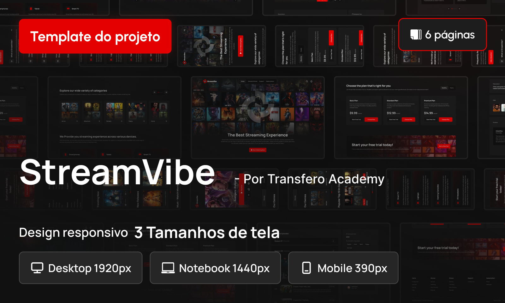

<h1 align="center">Projeto: StreamVibe</h1>

**StreamVibe** é um projeto web dedicado aos amantes de cinema, que oferece uma experiência interativa e intuitiva para explorar, descobrir e assistir filmes. Com uma interface moderna e responsiva, os usuários podem navegar por uma vasta coleção de filmes, acessar informações detalhadas, avaliações e trailers.

  <a href="#tecnologias">Tecnologias</a>&nbsp;&nbsp;&nbsp;|&nbsp;&nbsp;&nbsp;
  <a href="#contato">Contato</a>&nbsp;&nbsp;&nbsp;|&nbsp;&nbsp;&nbsp;
  <a href="#licença">Licença</a>

 

  

## Tecnologias usadas

## Contato

Para dúvidas ou sugestões, entre em contato:

- Email: walacecordeirodossantos@gmail.com
- LinkedIn: [walace-cordeiro-dos-santos](https://www.linkedin.com/in/walace-cordeiro-dos-santos/)

## Licença

Este projeto está licenciado sob a . Sinta-se à vontade para usar, modificar e distribuir este projeto.
